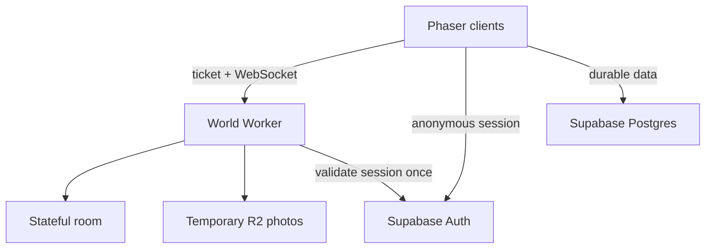

# Blockaroo architecture

## One community, invisible infrastructure

Nashville Town Square remains one player-facing place. The client never asks people to choose `Room 1`, `Room 2`, or a hidden server. A stateful Durable Object owns the logical space, and later cities/homes use the same `/world/:cityId/:spaceId` route with separate state owners behind it.



The browser first obtains a Supabase anonymous session. Players can later attach an email identity without losing that block. It exchanges the access token at `POST /session` for a short-lived HMAC ticket, then opens the world socket. The Supabase access token is never placed in the WebSocket URL.

## Movement protocol

Movement is instruction-driven rather than position-streamed:

1. The client predicts its own motion immediately.
2. It sends an 8-byte binary input when direction starts, changes, or stops; two bytes carry a wrapping client timestamp so the server can compensate for input transit time.
3. While continuously moving it repeats that instruction every three seconds so spatial membership cannot become stale.
4. The room stores the authoritative anchor position, velocity, sequence, and time in WebSocket attachment state.
5. Other clients receive a compact velocity change and render between packets.
6. Detailed moving neighbors are corrected in compact state batches during a 15-second reconciliation.
7. Small local errors ease into place; large errors snap to the authoritative position.

This avoids database writes and avoids sending an absolute position many times per second. The server still periodically supplies positions, so a dropped instruction cannot leave a block permanently drifting somewhere impossible.

## Three interest zones

Zones are calculated by the room. Players are never used as relay nodes, so closing one browser cannot break packet delivery.

| Zone | Maximum | Client behavior | Network behavior |
|---|---:|---|---|
| 1: detailed | 50 nearest | Render and interpolate | direction events, corrections, nearby chat/photo |
| 2: preload | next 150 | Hold offscreen state, normally hidden | enter/leave and coarse state only |
| 3: aggregate | everyone else | Show only total online count | no continuous per-player stream |

An `enter` snapshot is sent before a player reaches the detailed frame. When that player becomes visible, their identity, color, location, and velocity are already available. A full nearest-player reconciliation repairs membership every 15 seconds; movement heartbeats update a moving player’s prospective audience between those passes.

The current radii are deliberately server-owned constants. They can later become per-space settings without changing the binary format.

## Communication

Text is a small proximity WebSocket event. It lasts 12 seconds and is delivered only to the sender and up to 50 nearest players inside the chat radius.

Pictures and small GIFs follow a two-plane design:

1. The browser strips photo metadata by redrawing, resizes to at most 512 px, and compresses to JPEG. GIFs retain animation but are limited to 256 KB and 1024×1024.
2. It requests a one-time upload grant through its authenticated world socket.
3. The room rate-limits the request and signs a 30-second upload token for one random media ID.
4. The browser uploads at most 110 KB for a JPEG or 256 KB for a GIF directly to the private `blockaroo-temporary-media` R2 bucket through the Worker.
5. The room verifies that object and sends a 45-second download token only to the 12 closest players inside the chat radius.
6. Recipients download through the Worker; the image is never written to Supabase.
7. A minutely Cloudflare cleanup removes expired objects after roughly two minutes.

The WebSocket carries grants and metadata, not image bytes. HMAC tokens bind each upload to its authenticated sender, download links expire quickly, R2 remains private, and abandoned uploads are automatically removed.

## Social portal and durable media

Supabase RLS owns permanent identity and relationship decisions. Anonymous
players may move and use nearby talk, but only email-linked accounts can create
posts, add friends, enter homes, or use Circles.

Block Posts are chronological and friends-only. Their rows expire after 24
hours, and their photo/GIF bytes use the same private R2 bucket under a separate
`social/` prefix. Each media request carries the viewer's Supabase token. The
Worker queries the post through PostgREST with that token, so RLS decides
whether the viewer is the author or an accepted friend before R2 returns bytes.
Media posts begin in a private `media_ready = false` state. Friends only gain
row access after the R2 upload completes and the author marks the row ready,
which prevents a realtime feed notification from racing a missing object.
The client loads 20 posts per page and waits until media is near the viewport
before downloading it.

Normal post media receives the same 24-hour expiration metadata as its row.
Media pinned to Block Home has no object expiration, but its post stops
appearing in the feed after 24 hours. Each Block Home is capped at 12 pinned
posts.

Supabase Cron calls the database cleanup function every 15 minutes; the
Cloudflare cron removes expired R2 objects every minute. Account deletion first
removes every owned R2 object, then deletes the Supabase Auth user so cascading
foreign keys remove the remaining social records.

## Circles, voice, and games

Circle membership, invitations, access modes, host transfer, and one-member
shutdown live inside the same Durable Object as Town Square. Circle records are
persisted in Durable Object storage so WebSocket hibernation does not erase a
room or game. Draw & Guess histories use separate per-Circle storage keys rather
than one shared room value, keeping concurrent canvases below Durable Object
value-size limits.

Invites and joins are proximity-checked by the server. The Circle records its
formation center, and walking outside its 300-world-unit grace radius leaves
the Circle. Block lists are embedded in short-lived signed world tickets so
blocked pairs cannot form or signal inside a Circle even with a crafted client.

The world socket carries WebRTC offers, answers, and ICE candidates only between
members of the same Circle. Microphone audio never enters the WebSocket. The
Worker's authenticated `/ice-servers` endpoint mints short-lived Cloudflare TURN
credentials; when TURN is not configured, clients retain direct WebRTC plus
STUN and report that relay is unavailable.

All four game rules run server-side. Card hands, Draw & Guess words, and
Bluff/Impostor roles are sent as per-member private snapshots. Outsiders receive
only Circle count, access mode, and a broad activity label. Membership is
automatically locked while a game is active so a mid-round join cannot destroy
private state. When a Circle closes, its former members receive a lightweight
friend-request recap rather than a persistent group channel.

## Expansion model

Every live location uses the same stable address:

```ts
{ cityId: "nashville", spaceId: "town-square", kind: "town-square" }
```

New city squares, private overworlds, houses, and theaters get distinct `spaceId` values. Supabase stores durable ownership and relationships; the world service only holds ephemeral live state. A future gateway can shard a physically larger single space internally while keeping its public address unchanged.
