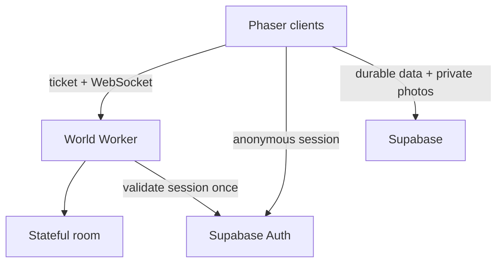

# Blockaroo architecture

## One community, invisible infrastructure

Nashville Town Square remains one player-facing place. The client never asks people to choose `Room 1`, `Room 2`, or a hidden server. A stateful Durable Object owns the logical space, and later cities/homes use the same `/world/:cityId/:spaceId` route with separate state owners behind it.



The browser first obtains a Supabase anonymous session. It exchanges the access token at `POST /session` for a short-lived HMAC ticket, then opens the world socket. The Supabase access token is never placed in the WebSocket URL.

## Movement protocol

Movement is instruction-driven rather than position-streamed:

1. The client predicts its own motion immediately.
2. It sends an 8-byte binary input when direction starts, changes, or stops; two bytes carry a wrapping client timestamp so the server can compensate for input transit time.
3. While continuously moving it repeats that instruction every three seconds so spatial membership cannot become stale.
4. The room stores the authoritative anchor position, velocity, sequence, and time in WebSocket attachment state.
5. Other clients receive a compact velocity change and render between packets.
6. Detailed moving neighbors are corrected in compact state batches during a 15-second reconciliation.
7. Small local errors ease into place; large errors snap to the authoritative position.

This avoids database writes and avoids sending an absolute position many times per second. The server still periodically supplies positions, so a dropped instruction cannot leave a block permanently drifting somewhere impossible.

## Three interest zones

Zones are calculated by the room. Players are never used as relay nodes, so closing one browser cannot break packet delivery.

| Zone | Maximum | Client behavior | Network behavior |
|---|---:|---|---|
| 1: detailed | 50 nearest | Render and interpolate | direction events, corrections, nearby chat/photo |
| 2: preload | next 150 | Hold offscreen state, normally hidden | enter/leave and coarse state only |
| 3: aggregate | everyone else | Show only total online count | no continuous per-player stream |

An `enter` snapshot is sent before a player reaches the detailed frame. When that player becomes visible, their identity, color, location, and velocity are already available. A full nearest-player reconciliation repairs membership every 15 seconds; movement heartbeats update a moving player’s prospective audience between those passes.

The current radii are deliberately server-owned constants. They can later become per-space settings without changing the binary format.

## Communication

Text is a small proximity WebSocket event. It lasts 12 seconds and is delivered only to the sender and up to 50 nearest players inside the chat radius.

Pictures follow a two-plane design:

1. The browser strips metadata by redrawing, resizes to at most 512 px, and compresses to JPEG.
2. It uploads once to the private `temporary-block-posts` bucket.
3. The WebSocket carries only the authenticated owner path.
4. Nearby recipients request a 30-second signed URL.
5. The sender removes the object after 60 seconds; a scheduled cleanup function catches abandoned uploads after two minutes.

This keeps binary photo data out of the world room and prevents one image from being repeated through every movement connection.

## Expansion model

Every live location uses the same stable address:

```ts
{ cityId: "nashville", spaceId: "town-square", kind: "town-square" }
```

New city squares, private overworlds, houses, and theaters get distinct `spaceId` values. Supabase stores durable ownership and relationships; the world service only holds ephemeral live state. A future gateway can shard a physically larger single space internally while keeping its public address unchanged.
